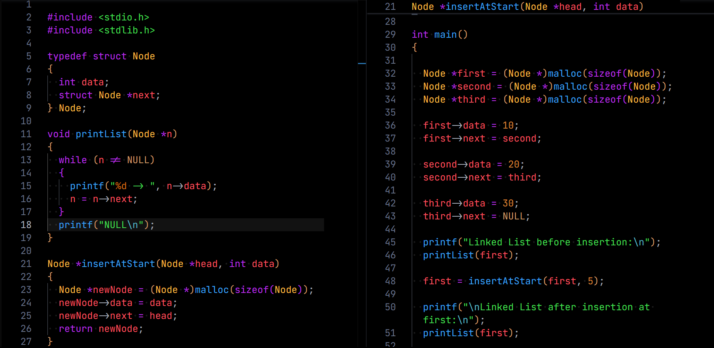
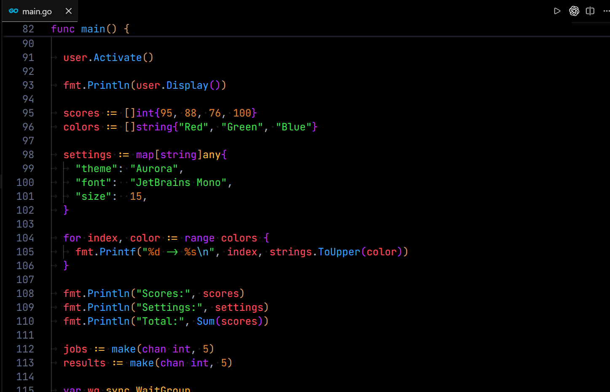
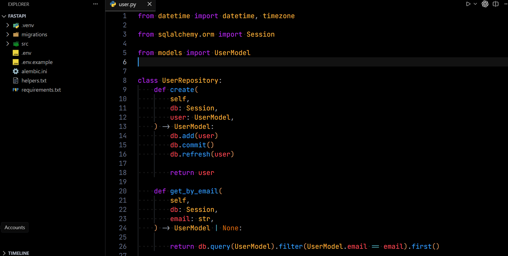
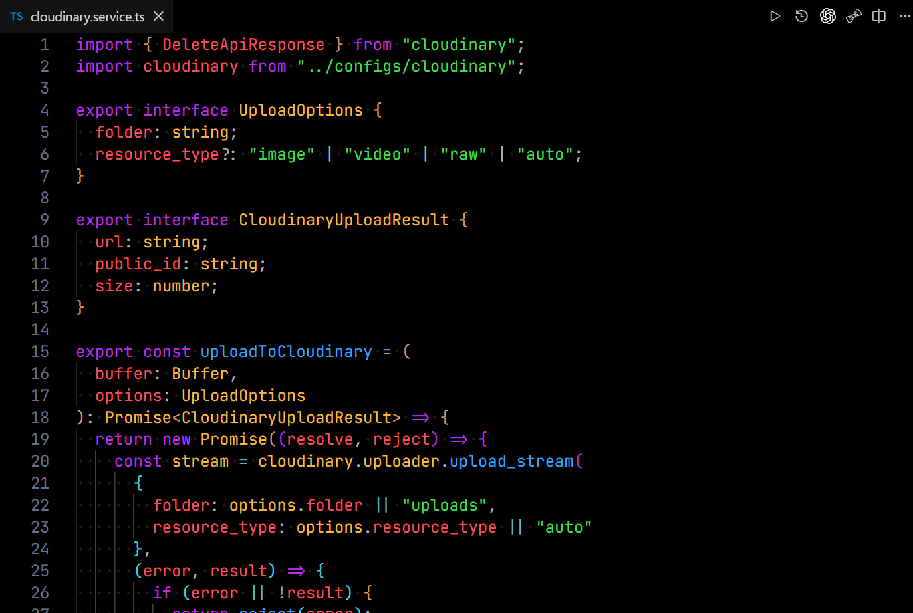
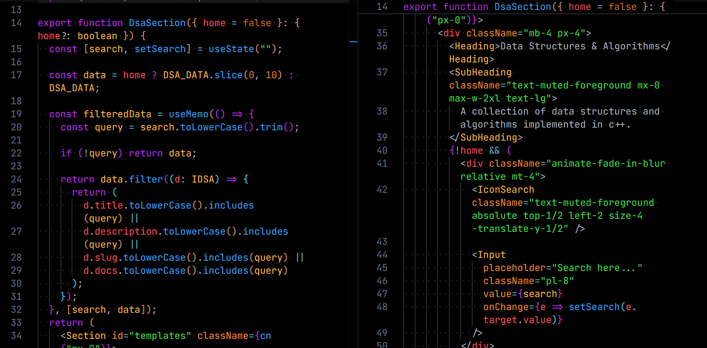

# Akkal Dark Theme

A modern dark theme for Visual Studio Code inspired by the timeless look and feel of **One Dark Pro**.

## Preview

## Features

* Inspired by the classic One Dark Pro aesthetic
* Carefully balanced dark color palette
* Optimized syntax highlighting
* Semantic highlighting support
* Custom workbench and terminal colors

## Installation

1. Open **Extensions** (`Ctrl + Shift + X`)
2. Search for **Akkal Dark Theme**
3. Click **Install**
4. Select **Akkal Dark Theme** from **Preferences → Color Theme**

## Support

If you enjoy **Akkal Dark Theme**, consider:

- ⭐ Starring the repository
- 📝 Leaving a review on the Visual Studio Marketplace
- 💬 Sharing it with other developers

Your support helps improve the theme and add support for more languages.

## License

MIT License

## GitHub Repo
[Akkal Dark Theme](https://github.com/AkkalDhami/akkal-dark-theme)